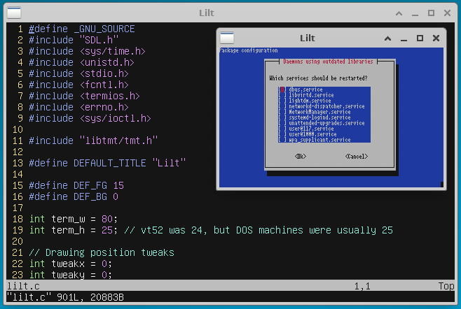

# Lilt: The Lil Terminal

Lilt is a graphical terminal emulator that emulates an ANSI terminal with
a couple of extensions (notably, xterm-style window title setting and mouse
clicking work).  Lilt was formerly (and briefly) known as Antsy Terminal.

It utilizes Rob King's Tiny Mock Terminal Library (libtmt) -- or my fork of
it -- to do the actual terminal escape sequence parsing, and it uses SDL1
to do the rendering, input, etc.



## Features

* Very simple/lightweight
* Nice default font and color scheme
* All resources get compiled into the binary
* Good enough emulation for vim and tmux
* X10-style mouse support (works in vim)
* Simple dependencies (just SDL and the libtmt repository)
* Good for constrained systems (uses vfork() for systems with no MMU, uses
  only a single thread)

Lilt should be fairly portable.  It currently has been tested with Linux
and macOS (see the "Building for macOS" section for more on the latter).

## Building

Lilt can be compiled either using the Rogo build system or using CMake.
These two options are detailed in the following subsections.

For simple scenarios, it can also be pretty trivially compiled entirely
by hand -- just compile `lilt.c` and `libtmt/tmt.c` and link them with
libSDL.)

If you're building on macOS, please see the subsection below.

### Rogo

To compile Lilt using the Rogo build system, install Rogue 1.5.1 or better
from here:

[https://github.com/AbePralle/Rogue](https://github.com/AbePralle/Rogue)

Then execute the following to build Lilt on Ubuntu or macOS:

    rogo

### CMake

You need SDL 1.2.  On Ubuntu, `apt install libsdl1.2-dev` should do it.

You need cmake.  On Ubuntu, `apt install cmake` should do it.

You need libtmt.  `git clone https://github.com/MurphyMc/libtmt` should
do it.

Configure the project using `cmake .` or `ccmake .`  The stock libtmt
(if you're using it instead of Murphy's fork) will require you to set
the `ANTSY_TITLE_SET` option to False.

You should then be able to build with `cmake --build .`.

### Building for macOS

With macOS, building Lilt probably takes a bit of effort if you're
using Mojave (and probably future versions).  A change in Mojave results
in SDL-based applications having blank windows (this problem isn't unique
to Lilt and affects other things including stuff like PyGame).  Until
it gets fixed, you might try building your own version of SDL using a this
[patch](https://github.com/joncampbell123/dosbox-x/commit/fdf6061c)
from DOSBox-X (if you do this, let me know if it works!).

If that sounds like a pain, the other option is to build Lilt using an
older version of the macOS SDK.  If you use the Rogo build method above
it will guide you through the necessary steps.

If you'd rather do it by hand but you don't have an old Xcode installed,
here are the basic steps to do it using the "Command Line Tools for
Xcode 10.1" which are available from Apple's developer website.

You can find the command line tools on Apple's developer website in the
["more" downloads area](https://developer.apple.com/download/more/).  You
want "Command Line Tools (macOS 10.13) for Xcode 10.1".  Mount the `.dmg`
file.  Then in a terminal in the Lilt directory, you should be able to do
something like:
```
pkgutil --expand-full /Volumes/Command*Tools/*10.13*.pkg CLT10_1
SDK=$(pwd)/$(find CLT10_1 -name MacOSX.sdk)
cmake -DCMAKE_OSX_DEPLOYMENT_TARGET=10.13 -DMAC_SDK_ROOT="$SDK" .
```

If all goes successsfully, you should now be able to do `cmake --build .`
as usual!

## Commandline options

* `-t TITLE` - Sets the initial window title
* `-e CMD ARGS...` - Run command instead of a shell (use as last argument)
* `-b MSEC` - Blink cursor every MSEC milliseconds
* `-d WxH` - Set window width and height (in characters)
* `-m` - Start with X10 mouse mode enabled
* `-M` - Start with 1006 mouse mode enabled

## Fonts

The font is compiled in.  If you have an image file with a font you want
to use instead, convert it to a PNM (e.g., using ImageMagick), and then
use the included `makefont.py` script to generate a new `font.h`.

The included one is based on one of the X fonts (7x14 fixed width).  It's
my belief that this font is in the public domain.  Thanks go to Lars C.
Hassing for making it available in an easy-to-consume form.

## Palettes

The palette is compiled in.  It's just 16 RGB colors -- 8 "normal" colors
followed by 8 "bright" variations which are used for bold.  The included
palette is vim-hybrid by w0ng (https://github.com/w0ng/vim-hybrid), though
I got it from https://terminal.sexy.  If you want to make your own, it's
a nice tool for doing so.  Export it in Alacritty format, and it's then
pretty easy to put it into the right form for `palette.h`.
